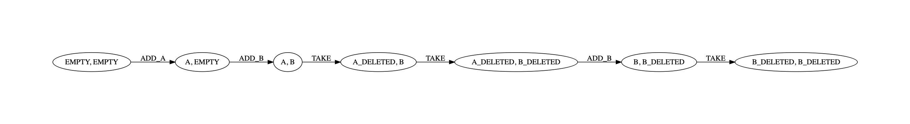

Event Analysis and Reconstruction in Lisp (EARL)
================================================

This repository contains implementation of digital event reconstruction algorithms that I developed in my PhD dissertation in 2004. 

Dependencies
------------

This software should run on Windows, Linux, and macOS. It relies on the following software packages:

 * [Steel Bank Common Lisp](http://www.sbcl.org) to run, and
 * [GraphViz](https://www.graphviz.org) to generate diagrams.

The easiest way to install both packages on Linux and macOS is via package managers (`apt` on Ubuntu / `brew` on macOS).

Running the software
--------------------

1. Read relevant parts of [thesis.pdf](thesis.pdf) (chapters 6 to 8),

2. clone or download this repository,

3. start terminal / command line window and navigate to the repository folder

```sh
$ cd /path/to/earl
```

4. start Steel Bank Common Lisp

```sh
$ sbcl
This is SBCL 2.0.2, an implementation of ANSI Common Lisp.
More information about SBCL is available at <http://www.sbcl.org/>.

SBCL is free software, provided as is, with absolutely no warranty.
It is mostly in the public domain; some portions are provided under
BSD-style licenses.  See the CREDITS and COPYING files in the
distribution for more information.
*
```

5. Load and run one of the examples (either *acme.lisp* or *slack.lisp*)

```lisp
* (load "acme")

"Is the meaning of es_ACME empty ?" 
NIL 
"Is the meaning of es''_ACME empty ?" 
T 
T
* 
```

Please refer to Section 8.3.1 of [thesis.pdf](thesis.pdf) to make sense of the printed results.

It should also generate `t.dot` file with the diagram of the solution. To visualise it, you could use `dot` utility from GraphViz package to generate a PDF:

```sh
$ dot -Tpdf t.dot >t.pdf
```

The resulting picture looks a bit like this:


